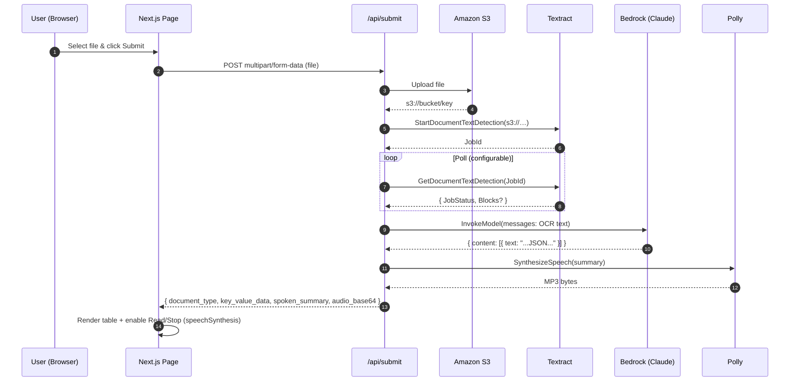

# Intelliparse

Smart document parsing with OCR (**AWS Textract**), structured extraction (**Bedrock Claude**), and speech playback (**AWS Polly**)—wrapped in a **Next.js** UI.

---

## ✨ Features

- Upload an image/PDF and get:
  - **Document type**
  - **Key–value pairs** (e.g., Amount, Date)
  - **Short spoken summary** (MP3 synthesized, base64 returned)
- Strong, deterministic unit tests for Textract, Bedrock, Polly, and the Page
- Configurable Textract polling, safe fallbacks for local/dev

---

## 🧱 Architecture

### Component View

```mermaid
flowchart LR
  classDef client fill:#e3f2fd,stroke:#1976d2,color:#0d47a1,stroke-width:1.5px
  classDef server fill:#e8f5e9,stroke:#2e7d32,color:#1b5e20,stroke-width:1.5px
  classDef aws fill:#fff3e0,stroke:#ef6c00,color:#e65100,stroke-width:1.5px
  linkStyle default stroke-width:1.3px

  subgraph Client["Client (Browser)"]
    UI[Next.js Page\n(Upload Form, Result, Speech)]
  end
  class UI client

  subgraph App["Next.js App Server"]
    API["/api/submit\n(route.ts)"]
    S3Lib["lib/s3.ts"]
    Tex["lib/textract.ts"]
    Bed["lib/bedrock.ts"]
    Pol["lib/polly.ts"]
  end
  class API,S3Lib,Tex,Bed,Pol server

  subgraph AWS["AWS Services"]
    S3[(Amazon S3\ns3://bucket/key)]
    TX[Amazon Textract]
    BR[Bedrock\nClaude Haiku]
    PL[Amazon Polly]
  end
  class S3,TX,BR,PL aws

  UI -->|multipart/form-data (file)| API
  API --> S3Lib
  S3Lib -->|PUT object| S3
  API --> Tex
  Tex -->|StartDocumentTextDetection| TX
  TX -->|JobId| Tex
  Tex -.->|poll GetDocumentTextDetection| TX
  TX -.->|Blocks (LINE…)| Tex
  Tex -->|OCR text| Bed
  Bed -->|InvokeModel (messages)| BR
  BR -->|JSON text block| Bed
  Bed -->|{document_type, key_value_data, spoken_summary}| API
  API --> Pol
  Pol -->|SynthesizeSpeech| PL
  PL -->|audio bytes| Pol
  Pol -->|audio_base64| API
  API -->|JSON + audio_base64| UI
```

### Request Flow



---

## 🗂️ Project Structure

```
app/
  api/submit/route.ts      # S3 -> Textract -> Bedrock -> Polly -> JSON
  page.tsx                 # Form, result table, Read/Stop speech
  layout.tsx
lib/
  s3.ts                    # Upload to S3
  textract.ts              # Start/Get Textract job, polling & timeouts
  bedrock.ts               # Invoke Bedrock model (Claude Haiku)
  polly.ts                 # Generate MP3 via Polly
  awsClientOptions.ts      # Shared client options
src/app/__tests__/page.test.tsx
src/lib/__tests__/bedrock.test.ts
src/lib/__tests__/polly.test.ts
src/lib/__tests__/textract.test.ts
src/test/setupAwsEnv.ts     # Test env helper for AWS vars
__mocks__/server-only.js
jest.config.js
jest.setup.ts
```

---

## 🔐 Prerequisites

- **Node 18+**
- **AWS account** with access to:
  - S3 (read/write)
  - Textract (`StartDocumentTextDetection`, `GetDocumentTextDetection`)
  - Bedrock (`InvokeModel` for your model)
  - Polly (`SynthesizeSpeech`)

**IAM (high level):**
- `s3:PutObject`, `s3:GetObject`
- `textract:StartDocumentTextDetection`, `textract:GetDocumentTextDetection`
- `bedrock:InvokeModel`
- `polly:SynthesizeSpeech`

> Ensure your S3 bucket and Textract are in the **same region**.

---

## ⚙️ Environment

Create `.env.local`:

```bash
# AWS
AWS_REGION=us-east-1
AWS_ACCESS_KEY_ID=AKIA...
AWS_SECRET_ACCESS_KEY=...

# Bedrock
BEDROCK_MODEL_ID=anthropic.claude-3-haiku-20240307-v1:0

# S3 (if referenced by your s3.ts)
S3_BUCKET=your-bucket-name

# Textract polling
# (defaults: tests→ 3 polls @ 5ms; dev/prod→ 60 polls @ 2000ms)
# TEXTRACT_POLL_MS=2000
# TEXTRACT_MAX_POLLS=60

# Dev helper: allow returning FAKE_TEXTRACT_TEXT on timeout
# ALLOW_FAKE_TEXTRACT=1
```

> Don’t commit `.env.local`. Add it to `.gitignore`.

---

## ▶️ Run

```bash
npm install
npm run dev
# open http://localhost:3000
```

Upload a sample invoice/receipt to see parsed results and try “Read Summary”.

---

## 🧪 Tests & Coverage

Run all tests:

```bash
npm test
```

With coverage:

```bash
npx jest --coverage
```

Run a specific file:

```bash
npx jest src/lib/__tests__/textract.test.ts
npx jest src/lib/__tests__/bedrock.test.ts
npx jest src/lib/__tests__/polly.test.ts
npx jest src/app/__tests__/page.test.tsx
```

**Testing notes**

- AWS SDKs are mocked with a shared `sendMock`, so each test controls exact responses.
- `jest.resetModules()` is used to avoid cached client singletons bleeding between tests.
- `jest.setup.ts` provides browser polyfills (speech synthesis, observers, etc.).

---

## 🔌 API

### `POST /api/submit`

**Request**: `multipart/form-data`, field `file` (required)

**Response**
```json
{
  "document_type": "Invoice",
  "key_value_data": { "Amount": "$100", "Date": "2025-01-01" },
  "spoken_summary": "Short summary of the document...",
  "audio_base64": "<base64 mp3>"
}
```

**Pipeline**
1. Upload file to S3
2. Textract: start job & poll until success (configurable)
3. Bedrock (Claude): parse OCR into structured JSON
4. Polly: synthesize spoken summary (MP3 → base64)

---

## 🛠️ Troubleshooting

- **`Missing AWS_ACCESS_KEY_ID in .env.local`**  
  Ensure all required vars exist; restart dev server after editing `.env.local`.

- **Textract always returns `FAKE_TEXTRACT_TEXT`**  
  Increase `TEXTRACT_MAX_POLLS` / `TEXTRACT_POLL_MS`, confirm S3/Textract same region, and ensure Textract can read from the bucket. If you set `ALLOW_FAKE_TEXTRACT=1`, you’ll see the fake value on timeout.

- **`Textract start returned no JobId`**  
  Check test mocks return `{ JobId }` on the first `send()`, and IAM in real runs.

- **Bedrock errors**  
  Validate `BEDROCK_MODEL_ID` and Bedrock access in your AWS account/region.

- **Speech not playing**  
  Browser autoplay policies might require a user gesture; use the Read/Stop buttons.

---

## 🔐 Sample S3 Policy (allow Textract read)

Replace `YOUR_BUCKET` and `YOUR_ACCOUNT_ID`.

```json
{
  "Version": "2012-10-17",
  "Statement": [
    {
      "Sid": "TextractReadObjects",
      "Effect": "Allow",
      "Principal": { "Service": "textract.amazonaws.com" },
      "Action": [ "s3:GetObject" ],
      "Resource": "arn:aws:s3:::YOUR_BUCKET/*",
      "Condition": {
        "StringEquals": {
          "aws:SourceAccount": "YOUR_ACCOUNT_ID"
        }
      }
    }
  ]
}
```

---

## 🚀 Deploy

Deploy to your favorite Next.js host. Provide the same environment variables in the host’s secrets/config. Prefer IAM roles (instance/task role or OIDC + IAM role) over static keys in production.

---

## 📄 License

MIT (or update to your preferred license).
