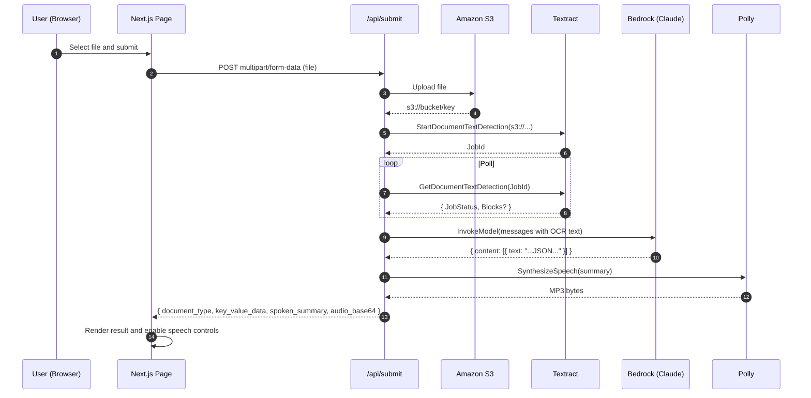

# Intelliparse

Intelliparse is a Next.js application that lets users upload documents (image/PDF), extract text using AWS Textract, parse structured fields with Bedrock (Claude), and synthesize a short spoken summary with AWS Polly. The API returns JSON and an MP3 audio payload (base64). The frontend renders the results and provides Read/Stop playback using the browser’s Web Speech API.

## Table of Contents

- [Architecture](#architecture)
- [Repository Structure](#repository-structure)
- [Prerequisites](#prerequisites)
- [Environment Variables](#environment-variables)
- [Local Development](#local-development)
- [Testing and Coverage](#testing-and-coverage)
- [Implementation Details](#implementation-details)
  - [Frontend (`app/page.tsx`)](#frontend-apppagetsx)
  - [API Route (`app/api/submit/route.ts`)](#api-route-appapisubmitroutets)
  - [AWS Libraries (`lib/*.ts`)](#aws-libraries-libts)
- [Terraform](#terraform)
- [Security and Operational Notes](#security-and-operational-notes)
- [Troubleshooting](#troubleshooting)
- [License](#license)

---

## Architecture

### Component view

```mermaid
flowchart LR
  classDef client fill:#e3f2fd,stroke:#1976d2,color:#0d47a1,stroke-width:1.5px
  classDef server fill:#e8f5e9,stroke:#2e7d32,color:#1b5e20,stroke-width:1.5px
  classDef aws fill:#fff3e0,stroke:#ef6c00,color:#e65100,stroke-width:1.5px

  subgraph Client["Client (Browser)"]
    UI[Next.js Page\n(Upload Form, Result, Speech)]
  end
  class UI client

  subgraph App["Next.js App Server"]
    API["/api/submit\n(route.ts)"]
    S3Lib["lib/s3.ts"]
    Tex["lib/textract.ts"]
    Bed["lib/bedrock.ts"]
    Pol["lib/polly.ts"]
  end
  class API,S3Lib,Tex,Bed,Pol server

  subgraph AWS["AWS Services"]
    S3[(Amazon S3\ns3://bucket/key)]
    TX[Amazon Textract]
    BR[Bedrock\nClaude]
    PL[Amazon Polly]
  end
  class S3,TX,BR,PL aws

  UI -->|multipart/form-data (file)| API
  API --> S3Lib
  S3Lib -->|Put object| S3
  API --> Tex
  Tex -->|StartDocumentTextDetection| TX
  TX -->|JobId| Tex
  Tex -.->|poll GetDocumentTextDetection| TX
  TX -.->|Blocks (LINE)| Tex
  Tex -->|OCR text| Bed
  Bed -->|InvokeModel| BR
  BR -->|JSON text block| Bed
  Bed -->|parsed {document_type, key_value_data, spoken_summary}| API
  API --> Pol
  Pol -->|SynthesizeSpeech| PL
  PL -->|audio bytes| Pol
  Pol -->|audio_base64| API
  API -->|JSON + audio_base64| UI
```

### Request flow



---

## Repository Structure

```
app/
  api/submit/route.ts          # API endpoint (Node runtime): S3 -> Textract -> Bedrock -> Polly -> JSON
  page.tsx                     # Client page: form upload, results, Read/Stop speech
  layout.tsx
lib/
  s3.ts                        # Upload file to S3 and return s3:// URL
  textract.ts                  # Start job and poll Textract; return joined LINE text
  bedrock.ts                   # Invoke Bedrock model; extract JSON from text block
  polly.ts                     # Polly synth; returns MP3 Blob
  awsClientOptions.ts          # Optional: shared client options
  kms.ts                       # Optional: KMS helpers if used
src/
  app/__tests__/page.test.tsx  # Frontend tests
  lib/__tests__/bedrock.test.ts
  lib/__tests__/polly.test.ts
  lib/__tests__/textract.test.ts
  test/setupAwsEnv.ts          # Test helper for AWS env
__mocks__/server-only.js       # Makes "server-only" inert in tests
jest.config.js
jest.setup.ts
tsconfig.json
terraform/
  main.tf
  outputs.tf
```

---

## Prerequisites

- Node.js 18 or newer.
- AWS account with permissions to:
  - S3: `s3:PutObject`, `s3:GetObject`
  - Textract: `textract:StartDocumentTextDetection`, `textract:GetDocumentTextDetection`
  - Bedrock: `bedrock:InvokeModel` for your selected model
  - Polly: `polly:SynthesizeSpeech`
- S3 bucket in the same region as Textract.

---

## Environment Variables

Create `.env.local` in the project root:

```bash
# AWS region
AWS_REGION=us-east-1

# Static credentials for local development.
# In production, prefer IAM roles instead of static keys.
AWS_ACCESS_KEY_ID=...
AWS_SECRET_ACCESS_KEY=...

# Bedrock model id (example)
BEDROCK_MODEL_ID=anthropic.claude-3-haiku-20240307-v1:0

# S3 bucket used by the app (if referenced in s3.ts)
S3_BUCKET=your-bucket-name

# Textract polling controls (defaults exist in code)
# TEXTRACT_POLL_MS=2000
# TEXTRACT_MAX_POLLS=60

# Optional: allow returning FAKE_TEXTRACT_TEXT on timeout in development
# ALLOW_FAKE_TEXTRACT=1
```

Notes:
- Do not commit `.env.local`.
- The code throws descriptive errors if required variables are missing.

---

## Local Development

Install dependencies and start the dev server:

```bash
npm install
npm run dev
# Open http://localhost:3000
```

Workflow:
1. Select a file and submit.
2. The page posts the file to `/api/submit`.
3. The server uploads to S3, runs Textract, calls Bedrock, then Polly.
4. The response contains parsed JSON plus an MP3 payload as base64. The UI renders the result.

---

## Testing and Coverage

Run all tests:

```bash
npm test
```

With coverage:

```bash
npx jest --coverage
```

Run a specific test file:

```bash
npx jest src/app/__tests__/page.test.tsx
npx jest src/lib/__tests__/textract.test.ts
npx jest src/lib/__tests__/bedrock.test.ts
npx jest src/lib/__tests__/polly.test.ts
```

Testing notes:
- AWS SDK clients are mocked per test so you can control their output deterministically.
- `jest.setup.ts` provides browser polyfills (observers, Web Speech API) for the React tests.
- For route tests, annotate with `@jest-environment node` if needed.

---

## Implementation Details

### Frontend (`app/page.tsx`)

- Manages form inputs, file selection, loading state, and parsed result via React state.
- On submit:
  - Builds `FormData` and posts to `/api/submit` with `axios.post`.
  - On a valid response, stores the result and re-renders the result section.
- Read/Stop buttons use the Web Speech API:
  - `SpeechSynthesisUtterance(result.spoken_summary)`
  - `window.speechSynthesis.speak` / `cancel`

Key points for testing stability:
- Each `<label>` has `htmlFor` and each `<input>` an `id`, enabling `getByLabelText`.
- The result view is conditional on `result` state.

### API Route (`app/api/submit/route.ts`)

Server-only route with `export const runtime = 'nodejs'`. Steps:
1. Read `formData`, validate `file`.
2. `uploadToS3(file)` returns `s3://bucket/key`.
3. `runTextract(s3Url)` returns OCR text (joined `LINE` blocks).
4. `runClaudeHaiku(ocrText)` returns `{ document_type, key_value_data, spoken_summary }`.
5. `generateSpeech(summary)` returns MP3 `Blob`; convert to base64 for JSON.
6. Respond with the JSON the frontend expects.

### AWS Libraries (`lib/*.ts`)

- `s3.ts`  
  Uploads a `File` to S3 and returns an `s3://` URL. Ensure the bucket and region match Textract and that Textract can read from the bucket object key.

- `textract.ts`  
  Starts a Textract job on the S3 object and polls until the job succeeds or fails. On success, collects `Blocks` of type `LINE` and returns the concatenated text. Polling duration and intervals can be controlled via environment variables.

- `bedrock.ts`  
  Invokes a Bedrock model (Claude). The response is an envelope whose first `content[].text` is expected to contain a JSON string. The code sanitizes control characters and falls back to a default object if parsing fails.

- `polly.ts`  
  Requests speech synthesis as MP3 using a selected voice and returns a `Blob` built from streamed bytes.

All libraries validate required environment variables at import time. In production, prefer IAM roles over static access keys.

---

## Terraform

The repository includes `terraform/main.tf` and `terraform/outputs.tf`. Typical resources for this application include:
- S3 bucket for uploads.
- IAM role and policies permitting:
  - S3 PutObject / GetObject
  - Textract StartDocumentTextDetection / GetDocumentTextDetection
  - Bedrock InvokeModel
  - Polly SynthesizeSpeech

Adjust to your account naming and tagging conventions.

Initialize and apply:

```bash
cd terraform
terraform init
terraform plan -out tf.plan
terraform apply tf.plan
```

After apply, export any outputs to your `.env.local` if needed (for example, the S3 bucket name).

---

## Security and Operational Notes

- Do not commit credentials. Use `.env.local` for local development and a secrets manager or host-provided environment variables in production.
- Prefer IAM roles over long-lived static access keys.
- Keep S3 and Textract in the same region to avoid cross-region latency and permission issues.
- Validate file types and sizes on upload if exposing this publicly.
- Log and observe API errors; add metrics and alarms for production readiness.

---

## Troubleshooting

- Missing AWS credentials or model id  
  Ensure all required variables exist in `.env.local`. Restart the dev server after editing.

- Textract always times out or returns no text  
  Increase `TEXTRACT_MAX_POLLS` or `TEXTRACT_POLL_MS`. Confirm S3 and Textract are in the same region and Textract has permission to read your S3 object.

- Bedrock errors about permission or model availability  
  Confirm `BEDROCK_MODEL_ID` and that Bedrock is enabled for your account and region with the correct permissions.

- Speech not playing in the browser  
  Browsers may require a user gesture to start audio. Use the provided buttons. Ensure `result.spoken_summary` exists.

---
